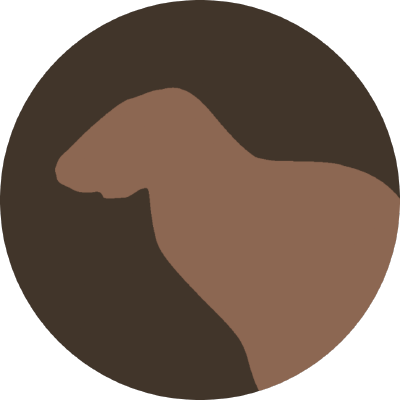
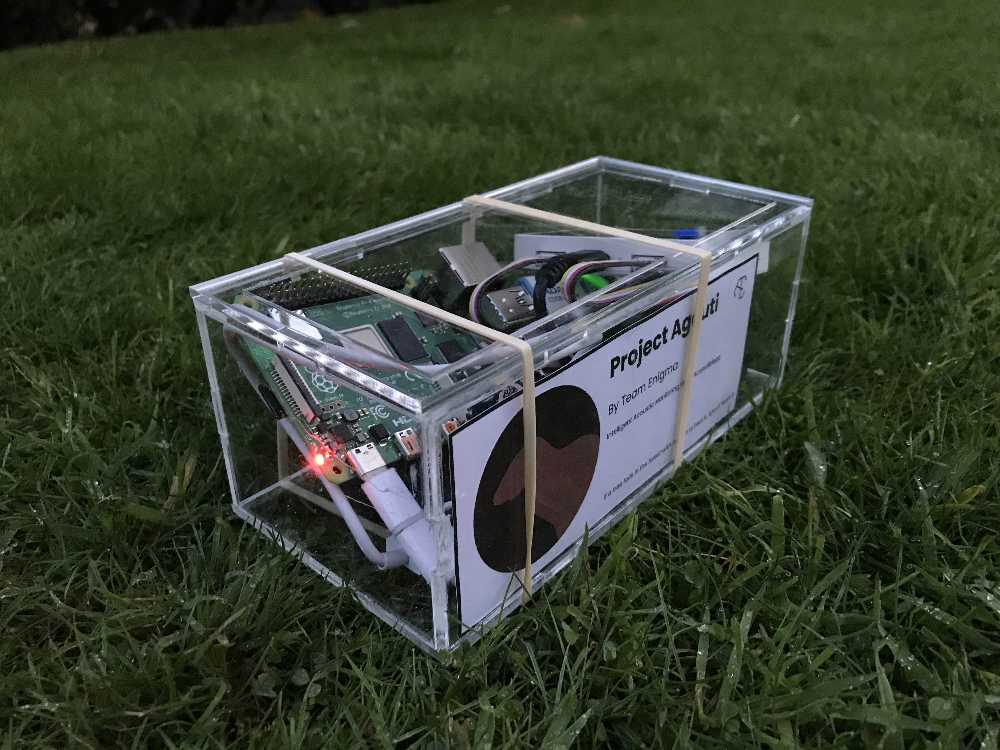

</img>

# Agouti - Supporting Files

_Intelligent acoustic monitoring made accessible_

## About

This repo contains all the additional files in our submission to the [Seeed X Hackster.io IoT Into the Wild Contest 2022](https://www.hackster.io/contests/iotinthewild). Each directory contains its own README file with instructions on setting things up.

##

You can find Seeed's summary of the contest [here](https://www.seeedstudio.com/blog/2023/02/15/seeed-launches-project-repository-of-iot2wild-contest-for-sustainable-planet-2022-available-for-free-downloads/), where we feature as a Helium Prize winner!

Copyright 2022 Agouti Acoustics
